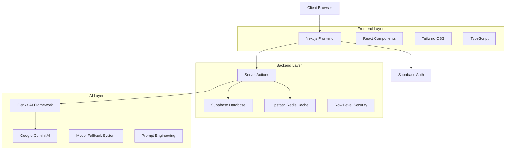
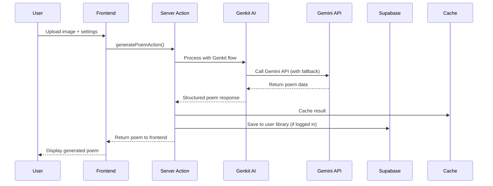
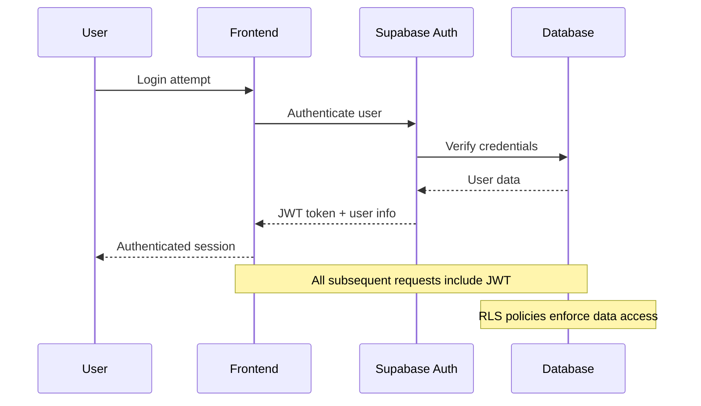

# Versify Technical Overview 🔧

This document provides a comprehensive technical overview of the Versify architecture, implementation details, and development guidelines.

## 🏗️ Architecture Overview

### System Architecture



### Key Components

#### Frontend Architecture
- **Next.js 15**: App Router with Server Components and Server Actions
- **React 19**: Latest React features with concurrent rendering
- **TypeScript**: Full type safety across the application
- **Tailwind CSS**: Utility-first styling with custom design system
- **Radix UI**: Accessible, unstyled component primitives

#### Backend Services
- **Supabase**: PostgreSQL database with real-time subscriptions
- **Supabase Auth**: Multi-provider authentication system
- **Upstash Redis**: Intelligent caching layer for performance
- **Server Actions**: Type-safe server-side operations

#### AI Integration
- **Google Gemini AI**: Multimodal AI for image analysis and text generation
- **Genkit Framework**: Structured AI flow management
- **Model Fallback**: Automatic failover across multiple AI models
- **Prompt Engineering**: Optimized prompts for poetry generation

## 🔄 Data Flow

### Poem Generation Flow



### Authentication Flow



## 🗄️ Database Schema

### Core Tables

```sql
-- Users table (managed by Supabase Auth)
CREATE TABLE auth.users (
    id UUID PRIMARY KEY,
    email TEXT UNIQUE,
    created_at TIMESTAMPTZ DEFAULT NOW()
);

-- User profiles
CREATE TABLE public.profiles (
    id UUID REFERENCES auth.users(id) PRIMARY KEY,
    display_name TEXT,
    avatar_url TEXT,
    settings JSONB DEFAULT '{}',
    created_at TIMESTAMPTZ DEFAULT NOW(),
    updated_at TIMESTAMPTZ DEFAULT NOW()
);

-- Poems
CREATE TABLE public.poems (
    id UUID DEFAULT gen_random_uuid() PRIMARY KEY,
    user_id UUID REFERENCES auth.users(id) ON DELETE CASCADE,
    title TEXT NOT NULL,
    poem TEXT NOT NULL,
    image JSONB NOT NULL, -- Image metadata and URL
    controls JSONB, -- Creative controls used
    collection TEXT,
    emotions TEXT[],
    visual_elements TEXT[],
    created_at TIMESTAMPTZ DEFAULT NOW(),
    updated_at TIMESTAMPTZ DEFAULT NOW()
);

-- Search index for poems
CREATE INDEX poems_search_idx ON poems 
USING gin(to_tsvector('english', title || ' ' || poem));

-- User-specific indexes
CREATE INDEX poems_user_id_idx ON poems(user_id);
CREATE INDEX poems_created_at_idx ON poems(created_at DESC);
```

### Row Level Security (RLS)

```sql
-- Enable RLS on all tables
ALTER TABLE profiles ENABLE ROW LEVEL SECURITY;
ALTER TABLE poems ENABLE ROW LEVEL SECURITY;

-- Profiles policies
CREATE POLICY "Users can view own profile" ON profiles
    FOR SELECT USING (auth.uid() = id);

CREATE POLICY "Users can update own profile" ON profiles
    FOR UPDATE USING (auth.uid() = id);

-- Poems policies
CREATE POLICY "Users can view own poems" ON poems
    FOR SELECT USING (auth.uid() = user_id);

CREATE POLICY "Users can insert own poems" ON poems
    FOR INSERT WITH CHECK (auth.uid() = user_id);

CREATE POLICY "Users can update own poems" ON poems
    FOR UPDATE USING (auth.uid() = user_id);

CREATE POLICY "Users can delete own poems" ON poems
    FOR DELETE USING (auth.uid() = user_id);
```

## 🤖 AI Implementation

### Genkit Flow Architecture

```typescript
// Core AI configuration
export const ai = genkit({
  plugins: [googleAI()],
  model: AVAILABLE_MODELS[0], // Primary model
});

// Model fallback system
export async function executeWithModelFallback<T>(
  operation: (model: string) => Promise<T>,
  startIndex: number = 0
): Promise<T> {
  for (let i = startIndex; i < AVAILABLE_MODELS.length; i++) {
    const model = AVAILABLE_MODELS[i];
    try {
      return await operation(model);
    } catch (error: any) {
      // Handle quota/rate limit errors with fallback
      if (isQuotaError(error) && i < AVAILABLE_MODELS.length - 1) {
        continue; // Try next model
      }
      throw error; // Re-throw if not recoverable
    }
  }
  throw new Error('All models exhausted');
}
```

### Prompt Engineering

```typescript
const prompt = ai.definePrompt({
  name: 'generatePoemFromImagePrompt',
  input: { schema: GeneratePoemFromImageInputSchema },
  output: { schema: GeneratePoemFromImageOutputSchema },
  prompt: `You are a poet specializing in creating poems from images.

  Analyze the image and generate a poem that reflects its content, 
  considering objects, colors, and emotions detected in the image.

  Creative Controls:
  - Poetry Style: {{{poetryStyle}}}
  - Tone: {{{tone}}}
  - Length: {{{length}}}
  - Literal vs Symbolic: {{{literalVsSymbolic}}}
  - Narrative: {{{narrative}}}
  - Keyword Emphasis: {{{keywordEmphasis}}}

  Image: {{media url=photoDataUri}}

  Return a JSON response with:
  - title: Creative title for the poem
  - poem: The generated poem text
  - emotions: Array of detected emotions
  - visualElements: Array of visual elements identified

  Ensure the poem is unique and personalized to the image content.`,
});
```

### Server Actions Implementation

```typescript
'use server'

export async function generatePoemAction(
  input: GeneratePoemFromImageInput
): Promise<GeneratePoemFromImageOutput> {
  try {
    // Validate input
    const validatedInput = GeneratePoemFromImageInputSchema.parse(input);
    
    // Generate poem with fallback
    const result = await generatePoemFromImage(validatedInput);
    
    // Cache result for performance
    await cachePoem(result);
    
    return result;
  } catch (error: any) {
    // Enhanced error handling
    if (error?.code === 429) {
      throw new Error('Service temporarily busy. Please try again.');
    }
    
    if (error?.message?.includes('quota')) {
      throw new Error('Rate limit reached. Please wait a moment.');
    }
    
    throw new Error('Failed to generate poem. Please try again.');
  }
}
```

## 🎨 Frontend Implementation

### Component Architecture

```typescript
// Main client component with memoization
export default function VersifyClient() {
  // Memoized handlers to prevent re-renders
  const handleImageUpload = useCallback((url: string) => {
    setImageDataUrl(url);
    // ... logic
  }, []);

  const handleGenerate = useCallback(async () => {
    // ... generation logic with error handling
  }, [imageDataUrl, controls, isUserLoggedIn]);

  // Memoized sidebar to prevent unnecessary re-renders
  const SidebarContent = useCallback(() => (
    // ... sidebar JSX
  ), [currentStep, imageDataUrl, controls]);

  return (
    // ... main JSX
  );
}
```

### State Management

```typescript
// Context for library management
export function LibraryProvider({ children }: { children: ReactNode }) {
  const { user } = useSupabaseUser();
  const supabase = createClient();

  // Real-time data fetching
  const { data: library = [], loading } = useSupabaseCollection<Poem>(
    "poems",
    user ? { column: "user_id", value: user.id } : undefined,
    { column: "created_at", ascending: false }
  );

  // Optimistic updates
  const addPoemToLibrary = async (poem: Omit<Poem, "id" | "userId" | "createdAt">) => {
    if (!user) throw new Error("User not logged in");
    
    // Add to database
    await addPoemToSupabase(supabase, user.id, poem);
    
    // Cache invalidation handled automatically by Supabase real-time
  };

  return (
    <LibraryContext.Provider value={{ library, addPoemToLibrary, ... }}>
      {children}
    </LibraryContext.Provider>
  );
}
```

### Performance Optimizations

```typescript
// Image optimization
const optimizeImage = async (file: File): Promise<string> => {
  return new Promise((resolve) => {
    const canvas = document.createElement('canvas');
    const ctx = canvas.getContext('2d')!;
    const img = new Image();
    
    img.onload = () => {
      // Resize if too large
      const maxWidth = 1920;
      const maxHeight = 1080;
      let { width, height } = img;
      
      if (width > maxWidth || height > maxHeight) {
        const ratio = Math.min(maxWidth / width, maxHeight / height);
        width *= ratio;
        height *= ratio;
      }
      
      canvas.width = width;
      canvas.height = height;
      
      // Draw and compress
      ctx.drawImage(img, 0, 0, width, height);
      resolve(canvas.toDataURL('image/jpeg', 0.8));
    };
    
    img.src = URL.createObjectURL(file);
  });
};
```

## 🚀 Performance & Optimization

### Caching Strategy

```typescript
// Redis caching implementation
export async function cachePoem(poem: Poem): Promise<void> {
  if (!redis) return;
  
  const key = `poem:${poem.id}`;
  await redis.setex(key, 3600, JSON.stringify(poem)); // 1 hour TTL
}

export async function getCachedPoem(id: string): Promise<Poem | null> {
  if (!redis) return null;
  
  const cached = await redis.get(`poem:${id}`);
  return cached ? JSON.parse(cached) : null;
}

// User-specific cache invalidation
export async function invalidateUserPoemsCache(userId: string): Promise<void> {
  if (!redis) return;
  
  const pattern = `user:${userId}:poems:*`;
  const keys = await redis.keys(pattern);
  
  if (keys.length > 0) {
    await redis.del(...keys);
  }
}
```

### Image Processing Pipeline

```typescript
// Client-side image processing
export class ImageProcessor {
  static async processImage(file: File): Promise<ProcessedImage> {
    // Validate file type and size
    this.validateImage(file);
    
    // Compress if needed
    const compressed = await this.compressImage(file);
    
    // Generate thumbnail
    const thumbnail = await this.generateThumbnail(compressed);
    
    // Extract metadata
    const metadata = await this.extractMetadata(compressed);
    
    return {
      original: compressed,
      thumbnail,
      metadata,
      dataUrl: await this.toDataUrl(compressed)
    };
  }
  
  private static async compressImage(file: File): Promise<File> {
    if (file.size <= 800 * 1024) return file; // Skip if under 800KB
    
    // Canvas-based compression logic
    // ...
  }
}
```

### Database Optimization

```sql
-- Optimized queries with proper indexing
EXPLAIN ANALYZE 
SELECT p.*, pr.display_name 
FROM poems p
LEFT JOIN profiles pr ON p.user_id = pr.id
WHERE p.user_id = $1
ORDER BY p.created_at DESC
LIMIT 20;

-- Full-text search optimization
SELECT p.*, ts_rank(search_vector, query) as rank
FROM poems p, plainto_tsquery('english', $2) query
WHERE p.user_id = $1 AND search_vector @@ query
ORDER BY rank DESC, created_at DESC;
```

## 🔒 Security Implementation

### Authentication & Authorization

```typescript
// Middleware for protected routes
export async function middleware(request: NextRequest) {
  const { supabase, response } = createMiddlewareClient({ request });
  
  // Refresh session if needed
  const { data: { session } } = await supabase.auth.getSession();
  
  // Protect authenticated routes
  if (request.nextUrl.pathname.startsWith('/library') && !session) {
    return NextResponse.redirect(new URL('/login', request.url));
  }
  
  return response;
}
```

### Input Validation

```typescript
// Zod schemas for type-safe validation
export const GeneratePoemFromImageInputSchema = z.object({
  photoDataUri: z
    .string()
    .regex(/^data:image\/(png|jpeg|webp);base64,/, 'Invalid image format')
    .refine(
      (data) => {
        const base64 = data.split(',')[1];
        const size = (base64.length * 3) / 4;
        return size <= 10 * 1024 * 1024; // 10MB limit
      },
      'Image too large'
    ),
  poetryStyle: z.enum(['Free Verse', 'Sonnet', 'Haiku', 'Limerick', 'Ballad']),
  tone: z.enum(['Neutral', 'Joyful', 'Melancholic', 'Romantic', 'Mysterious']),
  // ... other fields
});
```

### Rate Limiting

```typescript
// Redis-based rate limiting
export async function checkRateLimit(
  userId: string,
  action: string,
  limit: number,
  window: number
): Promise<boolean> {
  if (!redis) return true; // Allow if Redis unavailable
  
  const key = `rate_limit:${userId}:${action}`;
  const current = await redis.incr(key);
  
  if (current === 1) {
    await redis.expire(key, window);
  }
  
  return current <= limit;
}
```

## 📊 Monitoring & Analytics

### Error Tracking

```typescript
// Structured error logging
export function logError(error: Error, context: Record<string, any>) {
  console.error('Application Error:', {
    message: error.message,
    stack: error.stack,
    context,
    timestamp: new Date().toISOString(),
    userId: context.userId || 'anonymous'
  });
  
  // Send to monitoring service in production
  if (process.env.NODE_ENV === 'production') {
    // Sentry, LogRocket, etc.
  }
}
```

### Performance Monitoring

```typescript
// Performance tracking
export function trackPerformance(operation: string, duration: number, metadata?: any) {
  console.log('Performance Metric:', {
    operation,
    duration,
    metadata,
    timestamp: new Date().toISOString()
  });
  
  // Send to analytics service
  if (typeof window !== 'undefined') {
    // Client-side analytics
  }
}
```

## 🧪 Testing Strategy

### Unit Testing

```typescript
// Component testing with React Testing Library
describe('VersifyClient', () => {
  it('should handle image upload correctly', async () => {
    const mockOnImageUpload = jest.fn();
    
    render(
      <VersifyClient onImageUpload={mockOnImageUpload} />
    );
    
    const file = new File(['test'], 'test.jpg', { type: 'image/jpeg' });
    const input = screen.getByLabelText(/upload image/i);
    
    await user.upload(input, file);
    
    expect(mockOnImageUpload).toHaveBeenCalledWith(expect.any(String));
  });
});
```

### Integration Testing

```typescript
// API testing
describe('Poem Generation API', () => {
  it('should generate poem from image', async () => {
    const testImage = 'data:image/jpeg;base64,/9j/4AAQSkZJRgABAQAAAQ...';
    
    const result = await generatePoemAction({
      photoDataUri: testImage,
      poetryStyle: 'Free Verse',
      tone: 'Neutral',
      length: 'Medium'
    });
    
    expect(result).toMatchObject({
      title: expect.any(String),
      poem: expect.any(String),
      emotions: expect.any(Array),
      visualElements: expect.any(Array)
    });
  });
});
```

## 🚀 Deployment & DevOps

### Environment Configuration

```bash
# Production environment variables
NEXT_PUBLIC_SUPABASE_URL=https://your-project.supabase.co
NEXT_PUBLIC_SUPABASE_ANON_KEY=your-anon-key
SUPABASE_SERVICE_ROLE_KEY=your-service-role-key
GEMINI_API_KEY=your-gemini-api-key
KV_REST_API_URL=your-redis-url
KV_REST_API_TOKEN=your-redis-token
NODE_ENV=production
```

### Build Optimization

```typescript
// next.config.ts
const nextConfig: NextConfig = {
  // Server actions configuration
  serverActions: {
    bodySizeLimit: '10mb',
  },
  
  // Image optimization
  images: {
    domains: ['images.unsplash.com', 'your-supabase-project.supabase.co'],
    formats: ['image/webp', 'image/avif'],
  },
  
  // Bundle analysis
  webpack: (config, { dev, isServer }) => {
    if (!dev && !isServer) {
      config.resolve.alias = {
        ...config.resolve.alias,
        '@': path.resolve(__dirname, 'src'),
      };
    }
    return config;
  },
  
  // Experimental features
  experimental: {
    turbo: {
      rules: {
        '*.svg': {
          loaders: ['@svgr/webpack'],
          as: '*.js',
        },
      },
    },
  },
};
```

### CI/CD Pipeline

```yaml
# .github/workflows/deploy.yml
name: Deploy to Production

on:
  push:
    branches: [main]

jobs:
  test:
    runs-on: ubuntu-latest
    steps:
      - uses: actions/checkout@v4
      - uses: actions/setup-node@v4
        with:
          node-version: '18'
          cache: 'npm'
      
      - run: npm ci
      - run: npm run type-check
      - run: npm run lint
      - run: npm run test

  deploy:
    needs: test
    runs-on: ubuntu-latest
    steps:
      - uses: actions/checkout@v4
      - uses: vercel/action@v1
        with:
          vercel-token: ${{ secrets.VERCEL_TOKEN }}
          vercel-org-id: ${{ secrets.ORG_ID }}
          vercel-project-id: ${{ secrets.PROJECT_ID }}
```

---

This technical overview provides the foundation for understanding, maintaining, and extending the Versify platform. For specific implementation details, refer to the source code and inline documentation.