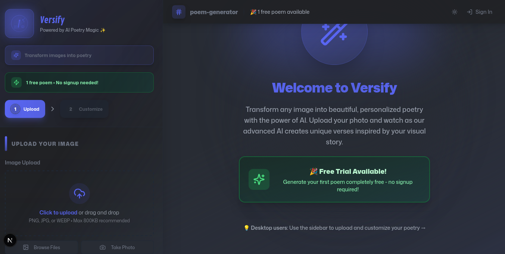
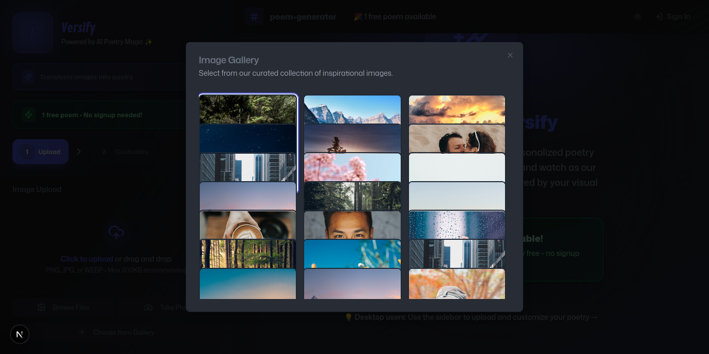
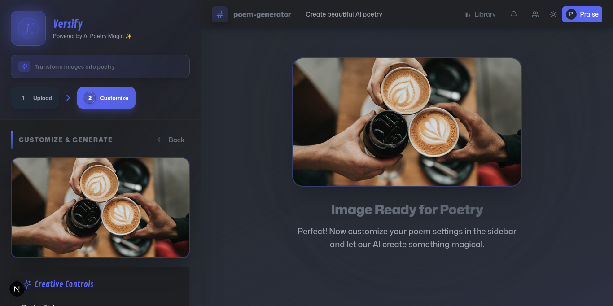
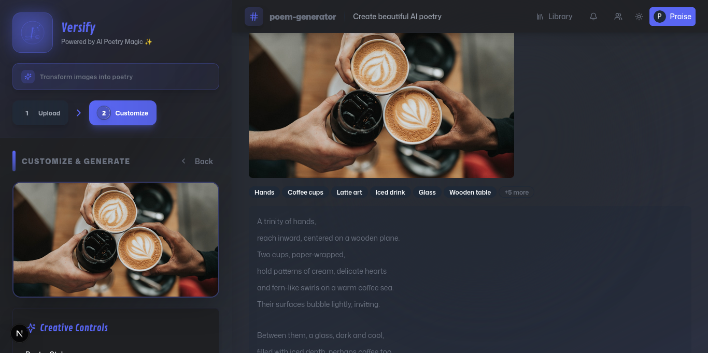
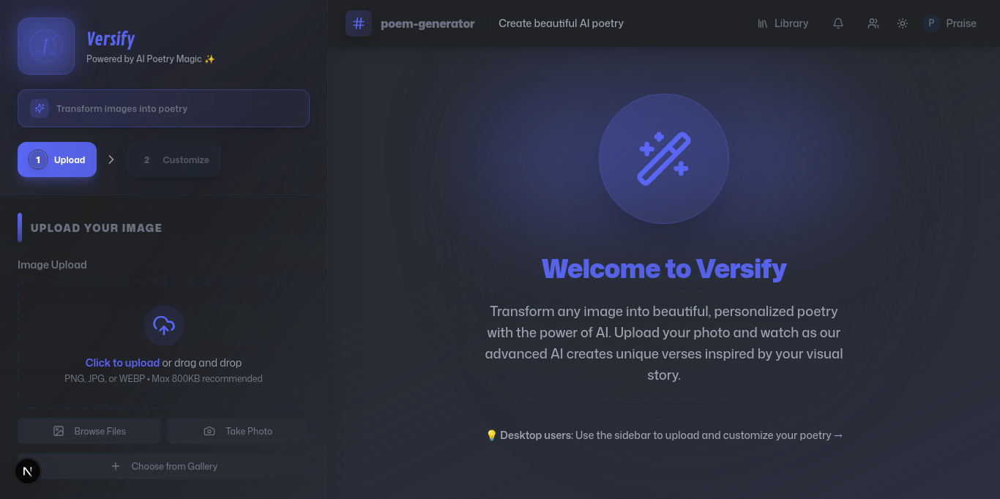

# Versify User Guide 📖

Welcome to Versify! This comprehensive guide will help you make the most of our AI-powered poetry generation platform.

## 🚀 Getting Started

### First Visit Experience

When you first visit Versify, you'll see:
- **Free Trial Banner**: Generate 1 poem without signing up
- **Upload Section**: Ready to accept your first image
- **Clean Interface**: Discord-inspired design that's intuitive and beautiful

### Creating Your First Poem

1. **Upload an Image**
   - Click "Browse Files" to select from your device
   - Or drag and drop an image directly
   - Supported formats: PNG, JPG, WEBP (max 800KB recommended)

2. **Choose from Gallery**
   
   - Click "Choose from Gallery" for curated images
   - Browse through professionally selected photos
   - Perfect for trying out the service

3. **Customize Your Poem**
   - **Poetry Style**: Free Verse, Sonnet, Haiku, Limerick, Ballad
   - **Tone**: Neutral, Joyful, Melancholic, Romantic, Mysterious
   - **Length**: Short, Medium, Long
   - **Symbolism**: Literal, Balanced, Symbolic
   - **Narrative**: Descriptive, Story-telling, Abstract

4. **Generate**
   
   - Click "Generate Poem" to start the AI process
   - Watch the beautiful loading animation
   - Our AI analyzes your image and creates unique poetry

5. **Enjoy Your Poem**
   
   - Read your personalized poem
   - Edit individual lines with AI suggestions
   - Save to your library (requires account)
   - Share with friends and family

## 👤 User Account Features

### Signing Up

**Benefits of Creating an Account:**
- ✅ **Unlimited Poems**: Generate as many poems as you want
- ✅ **Personal Library**: Save and organize all your creations
- ✅ **Collections**: Group poems by theme or occasion
- ✅ **Advanced Editing**: Line-by-line editing with AI assistance
- ✅ **Export Options**: Download poems in various formats
- ✅ **Search**: Find poems quickly with full-text search

**Sign Up Options:**
- Email and password
- Google OAuth (quick and secure)

### Managing Your Library

**Organizing Poems:**
- Create custom collections (Favorites, Drafts, etc.)
- Tag poems with keywords
- Sort by date, title, or collection
- Search across all your poems

**Editing Features:**
- **Title Generation**: AI can suggest new titles
- **Line Editing**: Click any line to get AI rewrite suggestions
- **Style Changes**: Regenerate with different creative controls
- **Inspiration Insights**: Get AI analysis of your poem's themes

## 🎨 Creative Controls Explained

### Poetry Styles

**Free Verse**
- No fixed rhyme scheme or meter
- Natural, conversational flow
- Great for beginners

**Sonnet**
- 14 lines with specific rhyme scheme
- Traditional and elegant
- Perfect for romantic themes

**Haiku**
- 3 lines, 5-7-5 syllable pattern
- Captures moments in nature
- Minimalist and profound

**Limerick**
- 5 lines with AABBA rhyme scheme
- Humorous and playful
- Great for fun images

**Ballad**
- Narrative poem with musical quality
- Tells a story
- Often emotional or dramatic

### Tone Options

- **Neutral**: Balanced, observational
- **Joyful**: Upbeat, celebratory, positive
- **Melancholic**: Thoughtful, wistful, introspective
- **Romantic**: Loving, passionate, tender
- **Mysterious**: Enigmatic, intriguing, atmospheric

### Length Settings

- **Short**: 4-8 lines, concise and impactful
- **Medium**: 8-16 lines, balanced development
- **Long**: 16+ lines, detailed exploration

### Symbolism Levels

- **Literal**: Direct description of what's seen
- **Balanced**: Mix of literal and metaphorical
- **Symbolic**: Heavy use of metaphors and symbols

### Narrative Styles

- **Descriptive**: Paints a picture with words
- **Story-telling**: Narrates events or experiences
- **Abstract**: Focuses on emotions and concepts

## 📱 Mobile Experience

Versify is fully optimized for mobile devices:

**Touch-Friendly Interface:**
- Large, easy-to-tap buttons
- Swipe gestures for navigation
- Optimized image upload

**Mobile-Specific Features:**
- Collapsible sidebar for more screen space
- Touch-optimized creative controls
- Mobile camera integration
- Responsive text sizing

## 🔧 Tips for Better Poems

### Choosing Great Images

**Best Image Types:**
- **Nature scenes**: Landscapes, flowers, animals
- **Portraits**: People with clear emotions
- **Architecture**: Buildings with character
- **Abstract art**: Colors and shapes
- **Personal photos**: Meaningful moments

**Image Quality Tips:**
- Use clear, well-lit photos
- Avoid heavily filtered images
- Higher resolution = better AI analysis
- Multiple subjects can create richer poems

### Optimizing Creative Controls

**For Emotional Images:**
- Use "Melancholic" or "Romantic" tone
- Try "Symbolic" for deeper meaning
- "Medium" length allows emotional development

**For Nature Photos:**
- "Haiku" style captures natural moments
- "Descriptive" narrative works well
- "Balanced" symbolism adds depth

**For Fun/Casual Images:**
- "Limerick" for humor
- "Joyful" tone for celebration
- "Literal" approach for clarity

### Getting the Best Results

1. **Experiment**: Try different style combinations
2. **Iterate**: Regenerate with tweaked settings
3. **Edit**: Use line-by-line editing for perfection
4. **Save Variations**: Keep different versions of favorites

## 🛠️ Troubleshooting

### Common Issues

**Image Upload Problems:**
- Check file size (under 10MB)
- Ensure supported format (PNG, JPG, WEBP)
- Try refreshing the page
- Clear browser cache

**Generation Errors:**
- Wait a moment and try again (rate limiting)
- Try different creative controls
- Check internet connection
- Contact support if persistent

**Account Issues:**
- Verify email address
- Check spam folder for verification
- Try password reset
- Use Google OAuth as alternative

### Performance Tips

**For Faster Generation:**
- Use smaller image files
- Avoid peak usage times
- Keep browser updated
- Close unnecessary tabs

**For Better Mobile Performance:**
- Use WiFi when possible
- Close other apps
- Update your browser
- Clear cache regularly

## 🎯 Advanced Features

### AI Insights

Get detailed analysis of your poems:
- **Emotional Themes**: What feelings the AI detected
- **Visual Elements**: Objects and scenes identified
- **Literary Devices**: Metaphors and symbols used
- **Improvement Suggestions**: Ways to enhance your poem

### Batch Operations

**For Power Users:**
- Generate multiple poems from one image
- Compare different style variations
- Export entire collections
- Bulk edit poem metadata

### API Integration

**For Developers:**
- REST API for poem generation
- Webhook support for automation
- Custom integration options
- Rate limiting and authentication

## 📞 Getting Help

### Support Channels

**Documentation:**
- User Guide (this document)
- API Documentation
- Video tutorials
- FAQ section

**Community:**
- GitHub Discussions
- Discord server
- User forums
- Social media

**Direct Support:**
- Email support
- Bug reports on GitHub
- Feature requests
- Priority support for premium users

### Feedback

We love hearing from our users! Share:
- Feature suggestions
- Bug reports
- Success stories
- Creative use cases

---

**Happy Poetry Creating! ✨**

Transform your images into beautiful poetry with Versify's AI-powered platform.